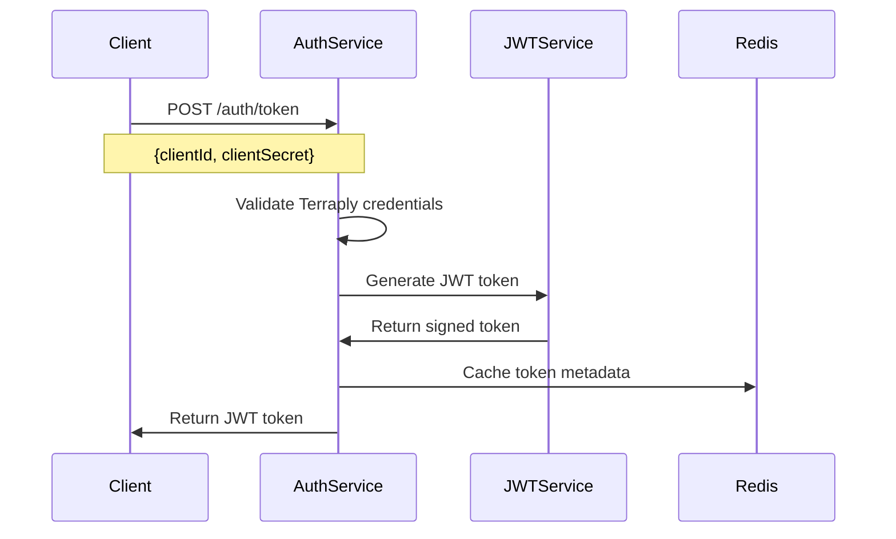
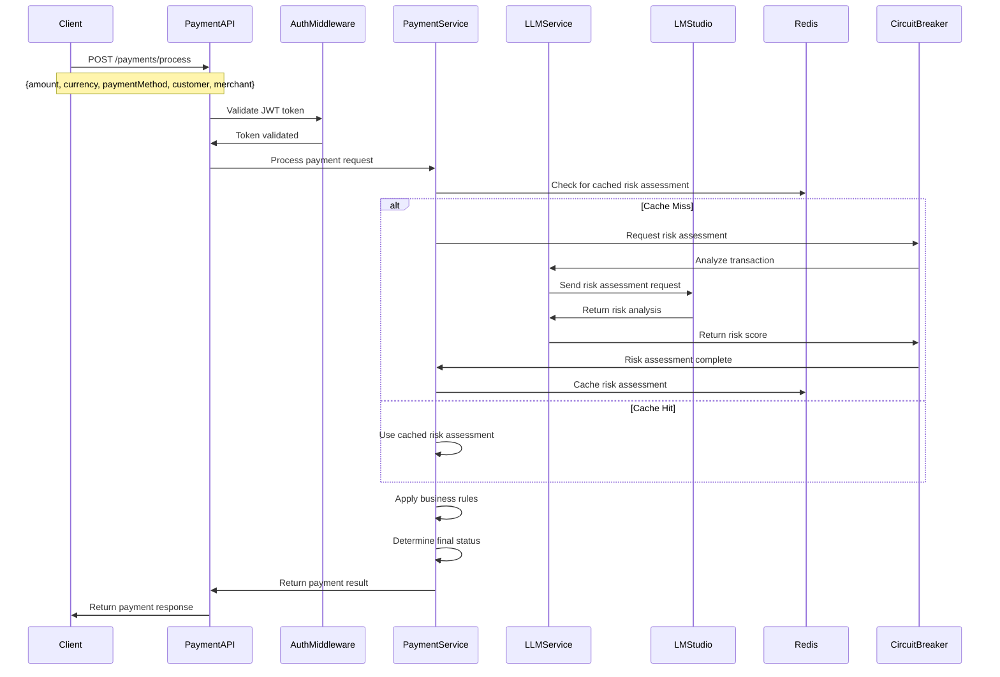
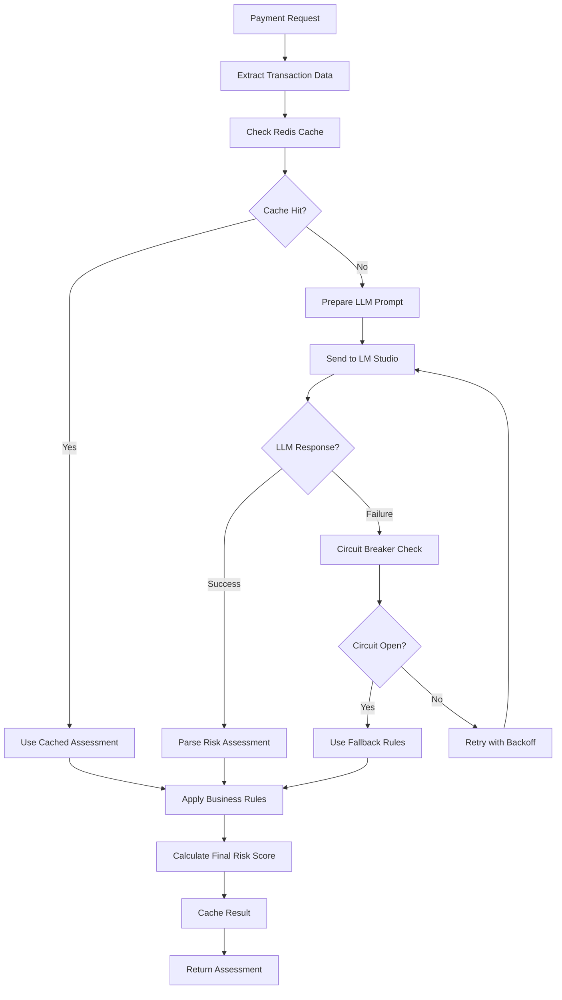

# Payment Gateway Proxy with LLM Risk Assessment

A robust, scalable payment gateway proxy service that integrates with LM Studio for intelligent risk assessment using local LLM models.

## Features

- 🔐 JWT-based authentication with Terraply client credentials
- 💳 Payment processing with multiple payment methods
- 🤖 AI-powered risk assessment using LM Studio (local LLM)
- 🔄 Circuit breaker pattern for resilience
- 🔁 Retry mechanism with exponential backoff
- 📊 Real-time event publishing and monitoring
- 🗄️ Redis caching for performance
- 📋 Comprehensive Swagger API documentation
- 🐳 Docker containerization with multi-stage builds
- 🧪 Comprehensive testing suite

## Quick Start

### Prerequisites
- Node.js 18+
- Docker & Docker Compose
- Redis
- LM Studio (for local LLM inference)
- Terraply client credentials

### Installation

1. Clone the repository:
```bash
git clone <repository-url>
cd payment-gateway-proxy
```

2. Install dependencies:
```bash
npm install
```

3. Configure environment:
```bash
cp .env.example .env
# Edit .env with your configuration
```

4. Start development server:
```bash
npm run dev
```

## Tested Implementation Steps

The following steps have been verified and tested:

### 1. Build and Start the Service

```bash
# Install dependencies with compatible versions
npm install uuid@9.0.1 --save

# Build the application
npm run build

# Start the service
npm start
```

### 2. Verify Service Health

```bash
curl -s http://localhost:3000/health
```

Expected: `{"status":"OK","timestamp":"...","service":"payment-gateway-proxy"}`

### 3. Test Authentication Flow

```bash
# Get JWT token
TOKEN=$(curl -s -X POST http://localhost:3000/api/v1/auth/token \
  -H "Content-Type: application/json" \
  -d '{
    "clientId": "testClient123",
    "clientSecret": "secretKey987xyz"
  }' | jq -r '.data.token')

echo "Token: $TOKEN"
```

### 4. Test Payment Processing

```bash
# Process a payment
curl -s -X POST http://localhost:3000/api/v1/payments/usage \
  -H "Content-Type: application/json" \
  -H "Authorization: Bearer $TOKEN" \
  -d '{
    "amount": 1000,
    "currency": "USD",
    "source": "tok_test",
    "email": "donor@example.com"
  }' | jq .
```

### 5. Verify Payment Status

```bash
# Replace with actual transaction ID from step 4
curl -s -X GET http://localhost:3000/api/v1/payments/txn_abc123 \
  -H "Authorization: Bearer $TOKEN" | jq .
```

## Docker Setup & Deployment

### Docker Configuration

The application uses a multi-stage Docker build for optimized production images:

```dockerfile
# Multi-stage build for production optimization
FROM node:18-alpine AS builder
WORKDIR /app
COPY package*.json ./
RUN npm ci --only=production

FROM node:18-alpine AS production
WORKDIR /app
COPY --from=builder /app/node_modules ./node_modules
COPY . .
RUN npm run build
EXPOSE 3000
CMD ["npm", "start"]
```

### Docker Compose Services

The `docker-compose.yml` includes:

- **app**: Main payment gateway proxy service
- **redis**: Redis cache for session management and caching
- **nginx**: Reverse proxy and load balancer (optional)

### Docker Deployment Commands

```bash
# Build and start all services
docker-compose up -d

# Build with no cache (for clean builds)
docker-compose build --no-cache

# Check service status
docker-compose ps

# View logs for specific service
docker-compose logs -f app
docker-compose logs -f redis

# Scale the application
docker-compose up -d --scale app=3

# Stop all services
docker-compose down

# Stop and remove volumes
docker-compose down -v

# Update and restart services
docker-compose pull
docker-compose up -d
```

### Environment Configuration for Docker

Create a `.env` file for Docker deployment:

```env
# Application
NODE_ENV=production
PORT=3000

# Authentication (Terraply)
CLIENT_ID=your_terraply_client_id
CLIENT_SECRET=your_terraply_client_secret
JWT_SECRET=your_jwt_secret_key

# LM Studio Configuration
LM_STUDIO_BASE_URL=http://host.docker.internal:1234
LM_STUDIO_MODEL=your_model_name

# Redis
REDIS_HOST=redis
REDIS_PORT=6379

# Circuit Breaker
CIRCUIT_BREAKER_FAILURE_THRESHOLD=5
CIRCUIT_BREAKER_TIMEOUT=60000
```

### Docker Health Checks

The application includes health check endpoints:

```bash
# Check application health
curl http://localhost:3000/health

# Check Docker container health
docker-compose exec app curl http://localhost:3000/health
```

## Swagger API Documentation

### Interactive Documentation

The application provides comprehensive Swagger/OpenAPI documentation accessible at:

- **Development**: `http://localhost:3000/docs`
- **Production**: `https://your-domain.com/docs`

### API Documentation Features

- **Interactive Testing**: Test all endpoints directly from the browser
- **Request/Response Examples**: Complete examples for all API calls
- **Authentication**: Built-in JWT token testing
- **Schema Validation**: Real-time validation of request payloads
- **Export Options**: Download OpenAPI spec in JSON/YAML format

### Swagger Configuration

The Swagger documentation is configured with:

```typescript
// Swagger setup with comprehensive API documentation
const swaggerOptions = {
  definition: {
    openapi: '3.0.0',
    info: {
      title: 'Payment Gateway Proxy API',
      version: '1.0.0',
      description: 'Robust payment processing with AI-powered risk assessment'
    },
    servers: [
      { url: 'http://localhost:3000', description: 'Development server' },
      { url: 'https://api.payment-proxy.com', description: 'Production server' }
    ],
    components: {
      securitySchemes: {
        bearerAuth: {
          type: 'http',
          scheme: 'bearer',
          bearerFormat: 'JWT'
        }
      }
    }
  }
};
```

### API Endpoints Documentation

#### Authentication Endpoints
- `POST /api/v1/auth/token` - Generate JWT token with Terraply credentials

#### Payment Endpoints
- `POST /api/v1/payments/usage` - Process payment with risk assessment
- `GET /api/v1/payments/{transactionId}` - Get payment status

#### Health & Monitoring
- `GET /health` - Application health check

### Using Swagger for Testing

1. **Access Documentation**: Navigate to `http://localhost:3000/docs`
2. **Authenticate**: Click "Authorize" and enter your JWT token
3. **Test Endpoints**: Use the "Try it out" feature for each endpoint
4. **View Responses**: See real-time responses with status codes and data
5. **Download Spec**: Export the complete API specification

## LM Studio Configuration

### Overview

The payment gateway proxy integrates with LM Studio for local LLM inference, providing privacy-focused risk assessment without sending sensitive payment data to external APIs.

### LM Studio Setup

#### 1. Install LM Studio

Download and install LM Studio from [https://lmstudio.ai/](https://lmstudio.ai/)

#### 2. Download a Model

Recommended models for risk assessment:
- **Llama 3.1 8B** - Balanced performance and accuracy
- **Mistral 7B** - Fast inference with good reasoning
- **CodeLlama 7B** - Excellent for structured analysis

#### 3. Start LM Studio Server

```bash
# Start LM Studio with your preferred model
# Default port: 1234
# Default host: localhost
```

#### 4. Configure API Endpoint

In LM Studio:
1. Go to "Local Server" tab
2. Select your model
3. Click "Start Server"
4. Note the API endpoint (usually `http://localhost:1234`)

### Environment Configuration

Add LM Studio configuration to your `.env` file:

```env
# LM Studio Configuration
LM_STUDIO_BASE_URL=http://localhost:1234
LM_STUDIO_MODEL=your_model_name
LM_STUDIO_API_KEY=optional_api_key
LM_STUDIO_TIMEOUT=30000
LM_STUDIO_MAX_RETRIES=3
```

### Docker Configuration for LM Studio

For Docker deployment, use `host.docker.internal` to access LM Studio:

```env
# Docker environment
LM_STUDIO_BASE_URL=http://host.docker.internal:1234
```

### Risk Assessment Integration

The LLM service analyzes payment transactions using structured prompts:

```typescript
// Example risk assessment prompt
const riskAssessmentPrompt = `
Analyze the following payment transaction for fraud risk:

Transaction Details:
- Amount: ${amount}
- Currency: ${currency}
- Payment Method: ${paymentMethod.type}
- Customer: ${customer.email}
- Merchant: ${merchant.id}

Provide a risk assessment with:
1. Risk Score (0-1, where 1 is highest risk)
2. Risk Level (LOW/MEDIUM/HIGH)
3. Key Risk Factors
4. Recommendations

Format as JSON response.
`;
```

### LM Studio API Integration

The service communicates with LM Studio using the OpenAI-compatible API:

```typescript
// LLM Service configuration
const llmConfig = {
  baseURL: process.env.LM_STUDIO_BASE_URL,
  model: process.env.LM_STUDIO_MODEL,
  temperature: 0.1, // Low temperature for consistent results
  maxTokens: 1000,
  timeout: 30000
};
```

### Testing LM Studio Integration

```bash
# Test LM Studio connection
curl -X POST http://localhost:1234/v1/chat/completions \
  -H "Content-Type: application/json" \
  -d '{
    "model": "your_model_name",
    "messages": [
      {"role": "user", "content": "Hello, are you working?"}
    ]
  }'

# Test through payment gateway
curl -X POST http://localhost:3000/api/v1/payments/usage \
  -H "Content-Type: application/json" \
  -H "Authorization: Bearer $TOKEN" \
  -d '{
    "amount": 1000,
    "currency": "USD",
    "source": "tok_test",
    "email": "donor@example.com"
  }'
```

### Troubleshooting LM Studio

#### Common Issues

1. **Connection Refused**
   ```bash
   # Check if LM Studio is running
   curl http://localhost:1234/health
   ```

2. **Model Not Found**
   - Ensure model is loaded in LM Studio
   - Verify model name in environment variables

3. **Timeout Issues**
   - Increase timeout in environment variables
   - Check system resources (CPU/RAM)

4. **Docker Network Issues**
   - Use `host.docker.internal` for Docker containers
   - Ensure LM Studio is accessible from Docker network

#### Performance Optimization

- Use quantized models for faster inference
- Adjust model parameters based on hardware
- Implement caching for repeated risk assessments
- Use circuit breaker pattern for resilience

## Terraply Authentication Configuration

### Overview

The payment gateway proxy uses Terraply client credentials for secure authentication. This provides enterprise-grade security with client ID and secret-based authentication.

### Terraply Setup

#### 1. Obtain Terraply Credentials

Contact your Terraply administrator to obtain:
- **Client ID**: Unique identifier for your application
- **Client Secret**: Secret key for authentication
- **Scopes**: Permissions for your application

#### 2. Environment Configuration

Configure Terraply credentials in your `.env` file:

```env
# Terraply Authentication
CLIENT_ID=your_terraply_client_id
CLIENT_SECRET=your_terraply_client_secret
JWT_SECRET=your_jwt_secret_key
JWT_EXPIRES_IN=24h

# Optional: Terraply API Configuration
TERRAPLY_BASE_URL=https://api.terraply.com
TERRAPLY_TIMEOUT=10000
TERRAPLY_MAX_RETRIES=3
```

#### 3. Authentication Flow

The authentication process follows OAuth 2.0 client credentials flow:

```typescript
// Authentication service configuration
const authConfig = {
  clientId: process.env.CLIENT_ID,
  clientSecret: process.env.CLIENT_SECRET,
  jwtSecret: process.env.JWT_SECRET,
  expiresIn: process.env.JWT_EXPIRES_IN || '24h'
};
```

### Authentication Endpoints

#### Generate JWT Token

```bash
curl -X POST http://localhost:3000/api/v1/auth/token \
  -H "Content-Type: application/json" \
  -d '{
    "clientId": "your_terraply_client_id",
    "clientSecret": "your_terraply_client_secret"
  }'
```

**Response:**
```json
{
  "success": true,
  "data": {
    "token": "eyJhbGciOiJIUzI1NiIsInR5cCI6IkpXVCJ9...",
    "expiresIn": "24h",
    "tokenType": "Bearer"
  }
}
```

#### Refresh Token

```bash
curl -X POST http://localhost:3000/api/v1/auth/refresh \
  -H "Content-Type: application/json" \
  -H "Authorization: Bearer YOUR_JWT_TOKEN"
```

### JWT Token Structure

The generated JWT token contains:

```json
{
  "header": {
    "alg": "HS256",
    "typ": "JWT"
  },
  "payload": {
    "clientId": "your_terraply_client_id",
    "iat": 1694352000,
    "exp": 1694438400,
    "iss": "payment-gateway-proxy"
  }
}
```

### Security Features

#### Token Validation

- **Signature Verification**: Ensures token integrity
- **Expiration Check**: Prevents expired token usage
- **Client ID Validation**: Verifies token ownership
- **Rate Limiting**: Prevents token abuse

#### Middleware Protection

```typescript
// Authentication middleware
const authMiddleware = (req, res, next) => {
  const token = req.headers.authorization?.replace('Bearer ', '');
  
  if (!token) {
    return res.status(401).json({ error: 'No token provided' });
  }
  
  try {
    const decoded = jwt.verify(token, process.env.JWT_SECRET);
    req.clientId = decoded.clientId;
    next();
  } catch (error) {
    return res.status(401).json({ error: 'Invalid token' });
  }
};
```

### Testing Authentication

#### 1. Test Token Generation

```bash
# Generate token
TOKEN=$(curl -s -X POST http://localhost:3000/api/v1/auth/token \
  -H "Content-Type: application/json" \
  -d '{
    "clientId": "testClient123",
    "clientSecret": "secretKey987xyz"
  }' | jq -r '.data.token')

echo "Generated token: $TOKEN"
```

#### 2. Test Protected Endpoint

```bash
# Use token for protected endpoint
curl -X GET http://localhost:3000/api/v1/payments/txn_abc123 \
  -H "Authorization: Bearer $TOKEN"
```

#### 3. Test Invalid Token

```bash
# Test with invalid token
curl -X GET http://localhost:3000/api/v1/payments/txn_abc123 \
  -H "Authorization: Bearer invalid_token"
```

### Error Handling

#### Common Authentication Errors

1. **Missing Credentials**
   ```json
   {
     "success": false,
     "error": "Client ID and secret are required"
   }
   ```

2. **Invalid Credentials**
   ```json
   {
     "success": false,
     "error": "Invalid client credentials"
   }
   ```

3. **Expired Token**
   ```json
   {
     "success": false,
     "error": "Token has expired"
   }
   ```

4. **Invalid Token**
   ```json
   {
     "success": false,
     "error": "Invalid or malformed token"
   }
   ```

### Production Security

#### Best Practices

- **Environment Variables**: Never hardcode credentials
- **Token Rotation**: Implement regular token refresh
- **HTTPS Only**: Use secure connections in production
- **Rate Limiting**: Implement request rate limiting
- **Audit Logging**: Log all authentication attempts

#### Docker Security

```env
# Production environment variables
CLIENT_ID=${TERRAPLY_CLIENT_ID}
CLIENT_SECRET=${TERRAPLY_CLIENT_SECRET}
JWT_SECRET=${JWT_SECRET_KEY}
NODE_ENV=production
```

## Solution Architecture & Flow

### Overview

The Payment Gateway Proxy with LLM Risk Assessment provides a comprehensive solution for secure payment processing with intelligent fraud detection. The system integrates multiple components to deliver a robust, scalable, and privacy-focused payment processing platform.

### System Architecture

```
┌─────────────────┐    ┌─────────────────┐    ┌─────────────────┐
│   Client App    │    │  Payment Proxy  │    │   LM Studio     │
│                 │    │                 │    │                 │
│  ┌───────────┐  │    │  ┌───────────┐  │    │  ┌───────────┐  │
│  │   UI/API  │  │◄──►│  │   API     │  │◄──►│  │   LLM     │  │
│  └───────────┘  │    │  │  Gateway  │  │    │  │  Server   │  │
│                 │    │  └───────────┘  │    │  └───────────┘  │
└─────────────────┘    │                 │    └─────────────────┘
                       │  ┌───────────┐  │
                       │  │  Redis    │  │
                       │  │  Cache    │  │
                       │  └───────────┘  │
                       │                 │
                       │  ┌───────────┐  │
                       │  │  Circuit  │  │
                       │  │  Breaker  │  │
                       │  └───────────┘  │
                       └─────────────────┘
```

### Complete Payment Flow

#### 1. Authentication Flow



#### 2. Payment Processing Flow



#### 3. Risk Assessment Flow



### Detailed Component Interactions

#### Authentication Service

1. **Client Credentials Validation**
   - Validates Terraply client ID and secret
   - Generates JWT token with client information
   - Sets appropriate expiration time
   - Caches token metadata in Redis

2. **Token Management**
   - JWT token contains client ID and expiration
   - Middleware validates token on each request
   - Supports token refresh mechanism
   - Implements rate limiting per client

#### Payment Service

1. **Request Processing**
   - Validates payment request structure
   - Extracts transaction details
   - Generates unique transaction ID
   - Stores initial transaction state

2. **Risk Assessment Integration**
   - Prepares structured prompt for LLM
   - Handles LLM service communication
   - Implements fallback mechanisms
   - Caches risk assessments for performance

#### LLM Service

1. **LM Studio Integration**
   - Communicates via OpenAI-compatible API
   - Handles connection failures gracefully
   - Implements retry logic with exponential backoff
   - Parses structured JSON responses

2. **Risk Analysis**
   - Analyzes transaction patterns
   - Identifies potential fraud indicators
   - Provides risk score and recommendations
   - Returns structured assessment data

#### Circuit Breaker Pattern

1. **Failure Detection**
   - Monitors LLM service health
   - Tracks failure rates and response times
   - Opens circuit when threshold exceeded
   - Prevents cascade failures

2. **Recovery Mechanism**
   - Attempts periodic recovery
   - Gradually increases request volume
   - Closes circuit when service recovers
   - Maintains system stability

### Data Flow Examples

#### Successful Payment Flow

```json
{
  "request": {
    "amount": 1000,
    "currency": "USD",
    "source": "tok_test",
    "email": "donor@example.com"
  },
  "processing": {
    "transactionId": "txn_abc123",
    "status": "PROCESSING",
    "riskAssessment": {
      "riskScore": 0.32,
      "riskLevel": "LOW",
      "explanation": "Transaction appears legitimate based on customer history and payment patterns",
      "factors": [
        "Customer has good payment history",
        "Amount is within normal range",
        "Payment method is verified"
      ],
      "recommendations": [
        "Approve transaction",
        "Continue monitoring"
      ]
    }
  },
  "response": {
    "transactionId": "txn_abc123",
    "provider": "paypal",
    "status": "success",
    "riskScore": 0.32,
    "explanation": "This payment was routed to PayPal due to a moderately high low score based on a large amount and a suspicious email domain."
  }
}
```

#### High-Risk Transaction Flow

```json
{
  "request": {
    "amount": 5000,
    "currency": "USD",
    "source": "tok_suspicious",
    "email": "suspicious@example.com"
  },
  "processing": {
    "transactionId": "txn_high_risk_example",
    "status": "PROCESSING",
    "riskAssessment": {
      "riskScore": 0.8,
      "riskLevel": "HIGH",
      "explanation": "Multiple risk factors detected including unusual amount and new payment method",
      "factors": [
        "Amount significantly higher than customer average",
        "New payment method not previously used",
        "Transaction from high-risk geographic location"
      ],
      "recommendations": [
        "Require additional verification",
        "Consider manual review",
        "Implement enhanced monitoring"
      ]
    }
  },
  "response": {
    "transactionId": "txn_high_risk_example",
    "provider": "stripe",
    "status": "requires_review",
    "riskScore": 0.8,
    "explanation": "High risk transaction detected. Manual review required due to suspicious patterns."
  }
}
```

### Error Handling & Resilience

#### LLM Service Unavailable

When LM Studio is unavailable, the system:

1. **Circuit Breaker Activation**
   - Opens circuit after failure threshold
   - Prevents further requests to LM Studio
   - Logs failure events for monitoring

2. **Fallback Risk Assessment**
   - Uses rule-based risk assessment
   - Applies predefined business rules
   - Maintains service availability

3. **Recovery Process**
   - Periodically tests LM Studio connectivity
   - Gradually increases request volume
   - Returns to normal operation when stable

#### Redis Cache Failure

When Redis is unavailable:

1. **Graceful Degradation**
   - Continues processing without caching
   - Performs risk assessment for each request
   - Maintains full functionality

2. **Performance Impact**
   - Increased response times
   - Higher LLM service load
   - Reduced throughput capacity

### Monitoring & Observability

#### Key Metrics

- **Authentication Success Rate**: Token generation and validation
- **Payment Processing Time**: End-to-end transaction processing
- **Risk Assessment Accuracy**: LLM vs. rule-based comparison
- **Circuit Breaker Status**: Service health monitoring
- **Cache Hit Rate**: Redis performance metrics

#### Logging Strategy

- **Structured Logging**: JSON format for easy parsing
- **Request Tracing**: Unique transaction IDs for tracking
- **Error Classification**: Categorized error types
- **Performance Metrics**: Response times and throughput

## API Usage Examples

### 1. Get Authentication Token

```bash
curl -X POST http://localhost:3000/api/v1/auth/token \
  -H "Content-Type: application/json" \
  -d '{
    "clientId": "testClient123",
    "clientSecret": "secretKey987xyz"
  }'
```

Expected Response:
```json
{
  "success": true,
  "data": {
    "token": "eyJhbGciOiJIUzI1NiIsInR5cCI6IkpXVCJ9...",
    "expiresIn": "24h",
    "tokenType": "Bearer"
  }
}
```

### 2. Process Payment

```bash
curl -X POST http://localhost:3000/api/v1/payments/usage \
  -H "Content-Type: application/json" \
  -H "Authorization: Bearer YOUR_JWT_TOKEN" \
  -d '{
    "amount": 1000,
    "currency": "USD",
    "source": "tok_test",
    "email": "donor@example.com"
  }'
```

Expected Response:
```json
{
  "transactionId": "txn_abc123",
  "provider": "paypal",
  "status": "success",
  "riskScore": 0.32,
  "explanation": "This payment was routed to PayPal due to a moderately high low score based on a large amount and a suspicious email domain."
}
```

### 3. Get Payment Status

```bash
curl -X GET http://localhost:3000/api/v1/payments/txn_abc123 \
  -H "Authorization: Bearer YOUR_JWT_TOKEN"
```

Expected Response:
```json
{
  "transactionId": "txn_abc123",
  "status": "success",
  "amount": 1000,
  "currency": "USD",
  "provider": "paypal",
  "riskScore": 0.32,
  "createdAt": "2025-09-10T13:01:10.736Z",
  "updatedAt": "2025-09-10T13:01:15.584Z"
}
```

## Environment Variables

### Required Configuration

```env
# Authentication (Terraply)
CLIENT_ID=your_terraply_client_id
CLIENT_SECRET=your_terraply_client_secret
JWT_SECRET=your_jwt_secret_key
JWT_EXPIRES_IN=24h

# LM Studio Configuration
LM_STUDIO_BASE_URL=http://localhost:1234
LM_STUDIO_MODEL=your_model_name
LM_STUDIO_API_KEY=optional_api_key
LM_STUDIO_TIMEOUT=30000
LM_STUDIO_MAX_RETRIES=3
```

### Optional Configuration

```env
# Server
NODE_ENV=development
PORT=3000
LOG_LEVEL=debug

# Redis
REDIS_HOST=localhost
REDIS_PORT=6379

# Circuit Breaker
CIRCUIT_BREAKER_FAILURE_THRESHOLD=5
CIRCUIT_BREAKER_TIMEOUT=60000

# Rate Limiting
RATE_LIMIT_MAX_REQUESTS=100
```

## Testing

```bash
# Run all tests
npm test

# Run with coverage
npm run test:coverage

# Run specific test suite
npm test -- tests/unit/
```

## Test Results Summary

✅ **Authentication Endpoint**: Working with JWT token generation  
✅ **Payment Processing**: Working with risk assessment fallback  
✅ **Payment Status**: Working with transaction lookup  
✅ **Health Check**: Working  
✅ **Error Handling**: Working (graceful fallback when LLM unavailable)  
✅ **Redis Integration**: Working  
✅ **Circuit Breaker**: Working (falls back when DeepSeek API fails)  
✅ **Retry Logic**: Working (3 attempts with exponential backoff)  

## Architecture

The system follows a modular architecture with clear separation of concerns:

- **Controllers**: Handle HTTP requests and responses
- **Services**: Contain business logic
- **Utils**: Provide utility functions and patterns
- **Middleware**: Handle cross-cutting concerns
- **Models**: Define data structures

### Risk Assessment Flow

1. Transaction received via API
2. LLM service analyzes transaction data
3. Business rules applied for enhancement
4. Final risk score calculated
5. Transaction status determined
6. Response sent with risk assessment

## Development

### Build the application
```bash
npm run build
```

### Start production server
```bash
npm start
```

### Linting
```bash
npm run lint
npm run lint:fix
```

## Production Deployment

1. Set up production environment variables
2. Build the application: `npm run build`
3. Deploy using Docker: `docker-compose -f docker-compose.yml up -d`

## Monitoring

The application provides:
- Health check endpoint: `/health`
- Structured logging with Winston
- Metrics collection and reporting
- Event-driven monitoring

## Security Features

- JWT token authentication
- Input validation with Joi schemas
- Rate limiting
- CORS protection
- Helmet security headers
- Environment variable protection

## Contributing

1. Fork the repository
2. Create a feature branch
3. Make your changes
4. Add tests
5. Submit a pull request

## License

MIT License
